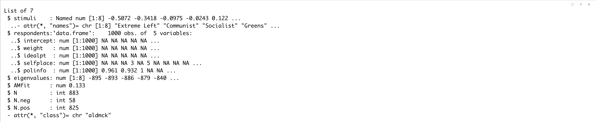
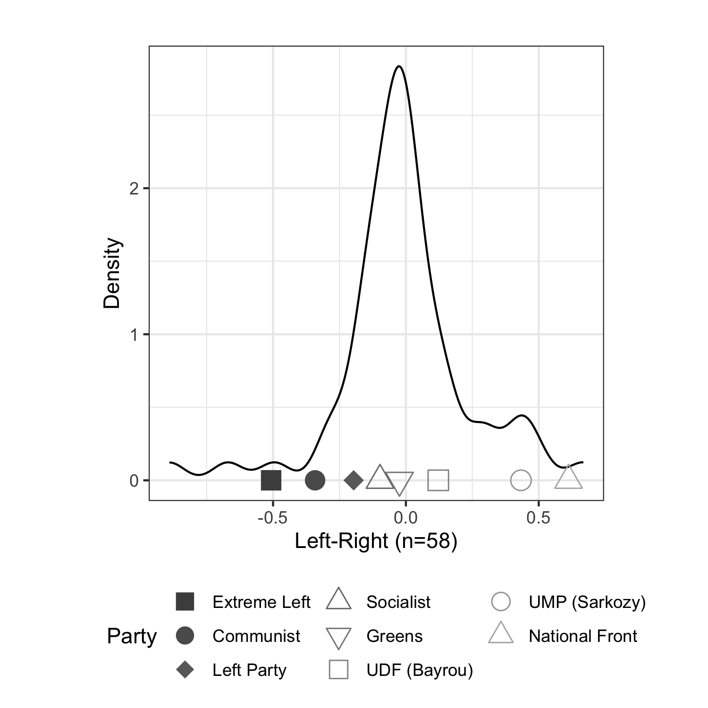

# asmcjr  <br /> 


This package supports the book ["Analyzing Spatial Models of Choice and Judgment with R"](https://www.crcpress.com/Analyzing-Spatial-Models-of-Choice-and-Judgment-with-R/Armstrong-II-Bakker-Carroll-Hare-Poole-Rosenthal/p/book/9781466517158).  In its second edition, much of the R code has been streamlined. This package contains all of the data and functions to replicate the analyses in the book. 

You can install using the `install_github()` function from the `devtools` package.  The package requires compilation, so Windows users will have to install [Rtools](https://cran.r-project.org/bin/windows/Rtools/) first.  

For Mac users, you need to  make sure you have already installed latest [GNU Fortran(gfortran 8.2)](https://github.com/fxcoudert/gfortran-for-macOS/releases) and [Xcode Developer Tools](https://developer.apple.com/support/xcode/). In order to use __rjags__ for the Bayesian framework analysis, you need to install [JAGS](https://sourceforge.net/projects/mcmc-jags/files/JAGS/) in advance. Please make sure you have installed [Clang (clang-8.0.0.pkg)](https://cran.r-project.org/bin/macosx/tools/) if you have not updated R to 4.0.0 version. Therefore to install __asmcjr__, the __devtools__ package must also be installed in R beforehand. 

## Installation 
```r
install.packages("devtools", dependencies=TRUE)
library(devtools)

devtools::install_github("yl17124/asmcjr")
library(asmcjr)
```


## Example 1: Running Bayesian Aldrich-Mckelvey Scaling on France EES (The European Election Studies )
```R
data(franceEES2009)
library(asmcjr)
library(ggplot2)
example_result_france <- aldmck(franceEES2009, respondent=1, 
                                polarity=2,missing=c(77,88,89), verbose=FALSE)
                                
str(example_result_france)                        
```

<p align="center">
  
</p>


```
example_result_graph <- ggplot.resphist(example_result_france, addStim=TRUE, weights="negative", xlab = "Left-Right") +
    theme(legend.position="bottom", aspect.ratio=1) +
    guides(shape = guide_legend(override.aes = list(size = 4),nrow=3)) +
    labs(shape="Party", colour="Party")
print(example_result_graph)
```
<p align="center">
  
</p>

## Example 2: Running WNOMINATE Scaling on Taiwean Legislative Roll Calls 
```r
data(legis_7th_Taiwan)
library(wnominate)
library(tidyverse)
library(pscl)
library(ggpubr)

head(legis_7th_Taiwan, n =10)
```
<p align="center">
  
</p>

```r
pscl_df <- rollcall(legis_7th_Taiwan[3:ncol(legis_7th_Taiwan)],
                    yea = 1 , nay = 2, notInLegis = c(3,4,5), legis.names = legis_7th_Taiwan$legis.names,
                    vote.names = colnames(legis_7th_Taiwan[3:ncol(legis_7th_Taiwan)]),
                    desc="The 7th Taiwan Legislative Roll Call")

summary(pscl_df, verbose=FALSE)      
```

<p align="center">
  
</p>


## Citing

For citation information, run `citation('dwnominate')`.
